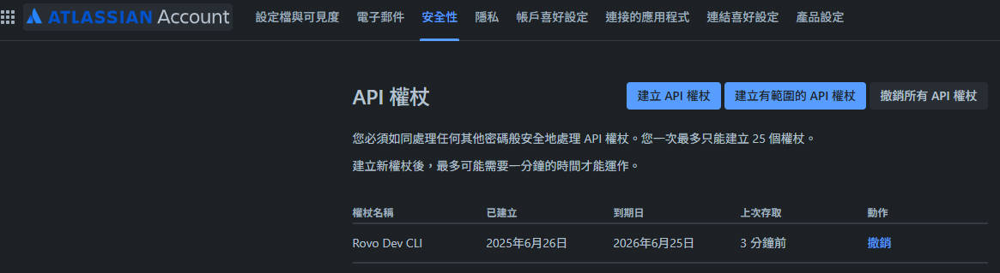
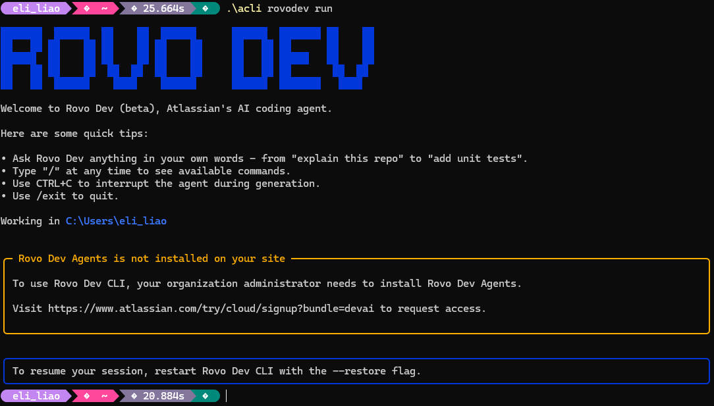

# RovoDevCLI
 這是我用來測試 Rovo Dev CLI 編程能力的專案，主要記錄我操作 Rovo Dev CLI 的步驟與流程。

 ---

## Windows 安裝
```bash
Invoke-WebRequest -Uri  https://acli.atlassian.com/windows/latest/acli_windows_amd64/acli.exe -OutFile acli.exe
```
執行完目錄會產生一個 acli.exe 的檔案，這檔案很大，大概 60 MB，基本上不需要進 Git 版控，需要時再安裝就可以。

## 測試安裝是否成功
```bash
.\acli.exe --help
```

## 建立 API KEY
網址: [Atlassian profile](https://id.atlassian.com/manage-profile/security/api-tokens)


## 登入 rovo dev
```bash
.\acli rovodev auth login
```
要輸入信箱與 API KEY

## 執行 rovo dev
```bash
.\acli rovodev run
```


## PROMPT 範例
我使用非常簡單的 PROMPT 來描述需求：
```bash
幫我建立一個網頁版的 todo list
```

## 操作流程
```bash
./acli rovodev run

███████  ██████  ██    ██  ██████      ██████  ███████ ██    ██
██   ██ ██    ██ ██    ██ ██    ██     ██   ██ ██      ██    ██
██████  ██    ██ ██    ██ ██    ██     ██   ██ █████   ██    ██
██   ██ ██    ██  ██  ██  ██    ██     ██   ██ ██       ██  ██
██   ██  ██████    ████    ██████      ██████  ███████   ████

Welcome to Rovo Dev (beta), Atlassian's AI coding agent.

Here are some quick tips:

• Ask Rovo Dev anything in your own words - from "explain this repo" to "add unit tests".
• Type "/" at any time to see available commands.
• Use CTRL+C to interrupt the agent during generation.
• Use /exit to quit.

Working in D:\github\chiisen\RovoDevCLI


> 幫我建立一個網頁版的 todo list

╭─ Response ───────────────────────────────────────────────────────────────────────────────────────────────────────────╮
│ 我來幫您建立一個網頁版的 todo list！首先讓我查看一下當前工作區的結構，然後創建一個功能完整的待辦事項應用。           │
╰──────────────────────────────────────────────────────────────────────────────────────────────────────────────────────╯
  └── Calling open_files: {"file_paths": ["README.md",".gitignore"]}
```

ROVO DEV 會先閱讀目錄內的檔案，例如: README.md 與 .gitignore。

```bash
  README.md:


    # RovoDevCLI
     這是我用來測試 Rovo Dev CLI 編程能力的專案，主要記錄我操作 Rovo Dev CLI 的步驟與流程。

     ---

    ## Windows 安裝
    ```bash
    Invoke-WebRequest -Uri  https://acli.atlassian.com/windows/latest/acli_windows_amd64/acli.exe -OutFile acli.exe
    ```
   (18 lines truncated)
    .\acli rovodev run
    ```
    

    ## PROMPT 範例
    我使用非常簡單的 PROMPT 來描述需求：
    ```bash
    幫我建立一個網頁版的 todo list
    ```


  .gitignore:


    acli.exe
```

上面是 README.md 與 .gitignore 的內容。

```bash
╭─ Response ───────────────────────────────────────────────────────────────────────────────────────────────────────────╮
│ 我看到這是一個用來測試 Rovo Dev CLI 的專案。現在我來為您建立一個功能完整的網頁版 todo list 應用。我會創建一個包含    │
│ HTML、CSS 和 JavaScript 的單頁面應用程式，具備添加、刪除、標記完成等功能。                                           │
╰──────────────────────────────────────────────────────────────────────────────────────────────────────────────────────╯
  └── Calling create_file: {"file_path": "index.html", "initial_content": "<!DOCTYPE html>\n<html lang=\"zh-TW\">\n<h...
  └── Calling create_file: {"file_path": "style.css", "initial_content": "/* 全域樣式 */\n* {\n    margin: 0;\n    paddin...
  └── Calling create_file: {"file_path": "script.js", "initial_content": "// 全域變數\nlet todos = [];\nlet currentFilter...


   Successfully created index.html.


   Successfully created style.css.


   Successfully created script.js.
```

接著會跟你確認建立 index.html、style.css、script.js 的內容。

```bash
╭─ Response ───────────────────────────────────────────────────────────────────────────────────────────────────────────╮
│ 太好了！我已經成功為您建立了一個功能完整的網頁版 todo list 應用程式。讓我為您介紹一下這個應用的特色功能：            │
│                                                                                                                      │
│                                                                                                                      │
│                                                     🎯 主要功能                                                      │
│                                                                                                                      │
│  • ✅ 新增待辦事項 - 輸入任務並按 Enter 或點擊新增按鈕                                                               │
│  • ✅ 標記完成/未完成 - 點擊圓形勾選框                                                                               │
│  • ✅ 編輯待辦事項 - 點擊編輯按鈕修改內容                                                                            │
│  • ✅ 刪除待辦事項 - 點擊垃圾桶圖示刪除                                                                              │
│  • ✅ 篩選功能 - 查看全部/進行中/已完成的任務                                                                        │
│  • ✅ 統計資訊 - 顯示總計、進行中、已完成的數量                                                                      │
│  • ✅ 清除已完成 - 一鍵清除所有已完成的任務                                                                          │
│  • ✅ 本地儲存 - 資料會自動保存在瀏覽器中                                                                            │
│                                                                                                                      │
│                                                                                                                      │
│                                                     🎨 設計特色                                                      │
│                                                                                                                      │
│  • 🌈 漂亮的漸層色彩設計                                                                                             │
│  • 📱 響應式設計，支援手機和桌面                                                                                     │
│  • ✨ 流暢的動畫效果                                                                                                 │
│  • 🎯 直觀的使用者介面                                                                                               │
│  • 🌟 現代化的視覺風格                                                                                               │
│                                                                                                                      │
│                                                                                                                      │
│                                                     🚀 額外功能                                                      │
│                                                                                                                      │
│  • ⌨️ 鍵盤快捷鍵支援 (Enter 新增、Escape 取消編輯)                                                                    │
│  • 📊 即時統計更新                                                                                                   │
│  • 💾 自動儲存到本地儲存                                                                                             │
│  • 🔍 空狀態提示                                                                                                     │
│  • ⏰ 顯示建立和完成時間                                                                                             │
│                                                                                                                      │
│ 現在您可以：                                                                                                         │
│                                                                                                                      │
│  1 直接使用 - 在瀏覽器中開啟 index.html 檔案就能開始使用                                                             │
│  2 測試功能 - 我可以幫您測試應用程式是否正常運作                                                                     │
│  3 客製化修改 - 如果您想要調整樣式、顏色或功能                                                                       │
│  4 部署到網站 - 我可以幫您準備部署到 GitHub Pages 或其他平台                                                         │
│                                                                                                                      │
│ 您想要我做什麼呢？                                                                                                   │
│                                                                                                                      │
│  • 🔍 測試應用程式功能是否正常？                                                                                     │
│  • 🎨 調整設計風格或顏色？                                                                                           │
│  • ⚡ 添加更多功能（如分類、優先級、截止日期等）？                                                                   │
│  • 🌐 準備部署到線上平台？                                                                                           │
╰──────────────────────────────────────────────────────────────────────────────────────────────────────────────────────╯
Session context: ▮▮▮▮▮▮▮▮▮▮ 20.2K/200K
Daily total:     ▮▮▮▮▮▮▮▮▮▮ 65.2K/20M


╭──────────────────────────────────────────────────────────────────────────────────────────────────────────────────────╮
│ > █                                                                                                                  │
╰──────────────────────────────────────────────────────────────────────────────────────────────────────────────────────╯
Type "/" for available commands.
```

最後回報結果。


## 測試應用程式
